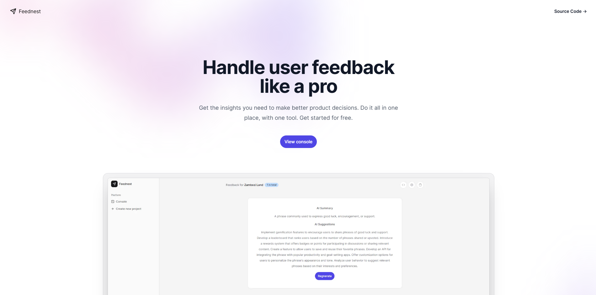

<p align="center">
  
</p>

## Intro 📜

Feednest is a powerful, user-friendly platform designed to help creators manage, and analyze feedback efficiently. Whether you're looking to improve a product, service, or process, this tool enables you to collect feedback from multiple sources, and derive actionable insights.

**Read more [here](https://devpost.com/software/feednest-ioy981)**

## Inspiration 🔮

In today's fast-paced, feedback-driven world, collecting and acting on user input is essential for continuous improvement. Many existing tools make feedback management more complex than it needs to be. We set out to create a solution that streamlines the process, making it easier and more efficient to gather and manage valuable insights

## Tools 🛠️

- **[Next.js 14](https://nextjs.org)**
- **[Convex](https://convex.dev)**
- **[HyperMode & Modus](https://hypermode.com)**
- **[Shadcn](https://ui.shadcn.com)**
- **[Resend](https://resend.com)**

## Widget ⌨️

The code for the widget can be found [here](https://github.com/lucky-chap/feednest-widget)

## Features ✨

- **Real-time Feedback Collection:** Collect feedback from multiple users in real-time and see responses as they come in. This was made possible by Convex's robust realtime architectrue
- **Statuses:** Change status of feedback (pending or resolved)
- **AI Feedback Summary:** Generate concise summaries of user feedback
- **AI Feedback Analysis:** Provide insights into user satisfaction and concerns & highlighting the key points for quick decision-making
- **User-friendly Interface:** Built with Tailwind UI and Shadcn, the tool offers a clean and intuitive user interface that enhances the user experience.

## How to use 🖊️

- Make sure you are [logged in](https://feednest.vercel.app/login).
- After login, you will be redirected to the dashboard where you can [create](https://feednest.vercel.app/create) orbits (feedback projects)
- After creating an orbit, you will be redirected to [/orbits](https://feednest.vercel.app/create) route where you can see your newly created orbit. Choose any one to get started
- On the orbit page, click on the `code` button to configure your orbit
- Follow the instructions from the above step to start collecting feedback on your website
- Good luck!

## Local development 🧑‍💻

- Clone the project to get started

```
git clone https://github.com/lucky-chap/feednest.git
```

- Copy the contents of `.env.example` into `.env.local` and fill with appropriate values

Run the following commands inside the project folder:

1. `pnpm install`
2. `npx convex dev` (to get convex functions ready)
3. `pnpm dev`

To view the project open `http://localhost:3000`.

## Star ✨

Give me a star would you...

## Contributing 🤝

Open a PR and let's build cool stuff

**After your pull request is merged**, you can safely delete your branch.

## License 📝

This project is licensed under the MIT License - see the [LICENSE](LICENSE) file for more information.

## 🔗 Useful links

- https://docs.hypermode.com/
- https://labs.convex.dev/auth/setup
- https://labs.convex.dev/auth/production
